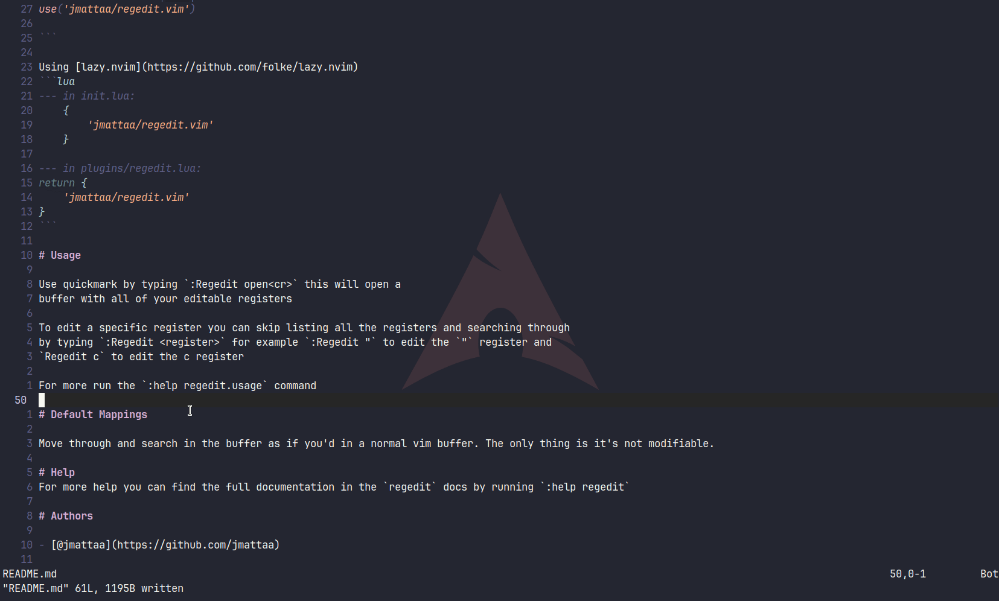

<div align="center">

# Regedit
##### Access your and edit your registers quickly



</div>

# ***Table of Contents***

- [Installation](#installation)
    - [Vim](#vim)
    - [Neovim](#neovim)
- [Usage](#usage)
- [Default Mappings](#default-mappings)
    - [Default regedit keys](#default-regedit-keys)
    - [Keystrokes in regedit window](#keystrokes-in-regedit-window)
- [Help](#help)
- [Authors](#authors)

# Installation

### Vim
Using [vim-plug](https://github.com/junegunn/vim-plug)

```vim
Plug 'jmattaa/regedit.vim'
```

### Neovim

Using [packer.nvim](https://github.com/wbthomason/packer.nvim)

```lua
use('jmattaa/regedit.vim')

```

Using [lazy.nvim](https://github.com/folke/lazy.nvim)
```lua
--- in init.lua:
    {
        'jmattaa/regedit.vim'
    }

--- in plugins/regedit.lua:
return {
    'jmattaa/regedit.vim'
}
```

# Usage

Use quickmark by typing `:Regedit open<cr>` this will open a 
buffer with all of your editable registers 

To edit a specific register you can skip listing all the registers and searching through
by typing `:Regedit <register>` for example `:Regedit "` to edit the `"` register and 
`Regedit c` to edit the c register

For more run the `:help regedit.usage` command

# Default Mappings

### Default regedit keys 
|                    |              |
|--------------------|--------------|
| Prefix key         | '<leader>r'  |
| Opening window     | '-'          |
| Clear registers    | '!'          |

There is one main key in the `regedit` default mappings that is the regedit
prefix key. By default this is `<leader>r` which means to edit a certain
register you can use `<prefix><register>` to edit your register.

There is also another key which is important for regedit and it is the
`Regedit.KeyOpen` this is the key after the `prefix` which will tell regedit
to open a buffer by default you can use `<prefix>-` this will open the buffer

To customize see more by typing `:help regedit.mappings`

### Keystrokes in regedit window

The default keys you can use to navigate and handle the quickmaps window 

| Key              | Action                                               |
|------------------|------------------------------------------------------|
| q                | Close the buffer list                                |
| j                | Move the cursor one line down                        |
| k                | Move the cursor one line up                          |
| Enter            | Edit the selected register                           |
| /`<searchterm>`  | To search for a specific `searchterm`                |

Move through and search in the buffer as if you'd in a normal vim buffer. The only thing is it's not modifiable.
Only one special key to quit the `regedit` buffer press `q` and you'll return to the previous open buffer

# Help
For more help you can find the full documentation in the `regedit` docs by running `:help regedit`

# Authors

- [@jmattaa](https://github.com/jmattaa)

